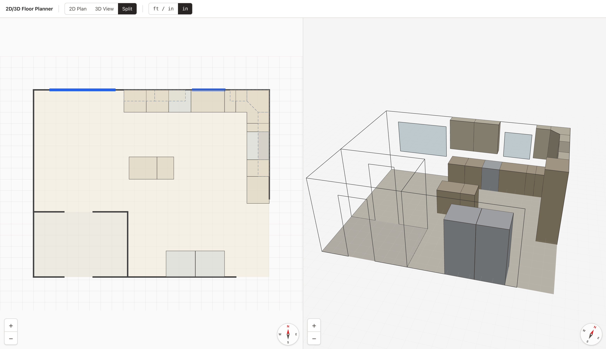

# 2D/3D Floor Planner

[](https://2d-3d-floor-planner.gallop.software)

A best-in-class TypeScript boilerplate for designing interior floor plans with **matched 2D and 3D views** of the same scene — built on React, Three.js, Zustand, and Zod — so you can build at the speed of thought with AI, ship an accurate planner, and rank #1 on Google.

**⚡ Demo:** [2d-3d-floor-planner.gallop.software](https://2d-3d-floor-planner.gallop.software)
**🎨 Template:** [gallop.software/templates](https://gallop.software/templates)
**📦 Repository:** [github.com/gallop-software/2d-3d-floor-planner](https://github.com/gallop-software/2d-3d-floor-planner)
**🏷️ Category:** 2D/3D Floor Planner Boilerplate

---

## Why Use Gallop Templates?

Just chat with AI inside your code editor using our Gallop templates, and you will never want to wrestle with a heavyweight CAD suite, a bloated drag-and-drop room designer, or a proprietary file format again. Simply describe the space you want, and AI writes the code. No SketchUp, no AutoCAD, no visual editors, and no design limitations. Just type and watch. Lay out rooms and walls, place windows, doors, cabinets and appliances, toggle between accurate 2D and 3D views, configure your SEO and AI discoverability instantly, expand endlessly, and get prompting tips from our [Gallop community](https://gallop-software.slack.com/). Go live in minutes.

[](https://gallop.software/#learn-more)

---

## Features

- 🧱 **One typed scene, two views** — a single source-of-truth JSON scene drives both the 2D plan and the 3D model, so they can never drift
- 📐 **Precise dimensions** — all linear values stored in inches; imperial (`ft / in`) display by default with an `in` toggle
- ⚛️ **React 18 + TypeScript** with strict typing end-to-end
- 🧊 **Three.js** via `@react-three/fiber` + `@react-three/drei` for the 3D view
- ✏️ **Plain SVG** 2D floor plan — crisp at any zoom, fully measured
- 🗂️ **Edit one file** — describe your whole space in `src/design/home.ts`; an edge/bounds authoring DSL keeps the math out of your way
- 🛡️ **Zod-validated** scene contract — bad layouts surface as clear errors instead of broken renders
- 🎯 **Click-to-select** any wall, opening, room, or fixture in either view, with a shared tooltip showing labels and dimensions
- 🧭 **Live compass** that stays north-up in 2D and tracks the camera in 3D
- 🤖 **AI-friendly** codebase structure with TypeScript strict mode
- 🔍 **SEO and AI optimized** with meta tags, Open Graph, and Twitter cards
- ⚡ **Vite** for instant hot reload and lightning-fast production builds
- 🏠 **Starter home** included so the project runs out of the box

---

## Getting Started

New to this? No problem. You'll have AI guiding you the entire way. Choose your editor below and follow the steps.

### Choose Your Editor

We recommend the **Gallop AI Editor** for the best experience with Gallop templates — whether you're a beginner or an advanced developer who wants AI-assisted iteration. It was purpose-built for this workflow and requires zero configuration. VS Code is also a fine choice if you prefer to work without AI assistance.

| | Gallop AI Editor | VS Code |
|---|---|---|
| **Best for** | Non-programmers, junior programmers, advanced programmers | Advanced programmers |
| **AI built in** | Yes — Claude AI ready to go | No (optional extensions available) |
| **AI setup requirement** | Enter Claude API keys | Install extensions manually |
| **Template browser** | Built-in marketplace | Download ZIP from GitHub |
| **Media manager** | Built-in Studio with CDN sync | Manual file management |
| **Font manager** | Built-in Studio with WOFF2 font generation | No support |
| **SEO Audit** | Analyze SEO & Structured Data | No support |
| **Git** | Better Git UI with modal diff viewer | Default Git UI |
| **Node.js** | Built-in installer and version manager | Install Node.js separately |

---

### Option A: Gallop AI Editor (Recommended)

The Gallop AI Editor is a desktop app built specifically for AI-powered web development. It includes everything you need — code editor, AI assistant, Git, terminal, media manager, font manager, SEO & structured data scanner, and a template marketplace — all in one window with nothing to configure.

[](https://gallop.software/)

Available for Mac and Windows.

#### Step 1: Install Gallop AI Editor

1. Go to [gallop.software](https://gallop.software/) and download the installer for your platform
2. Open the installer and follow the prompts
3. Launch the Gallop AI Editor
4. If prompted, the editor will walk you through installing Node.js automatically — just follow the on-screen steps

#### Step 2: Open This Template

**From the built-in template marketplace:**

1. Click the **Templates** tab in the sidebar
2. Find **2D/3D Floor Planner** and click **Clone**
3. Choose a folder on your computer (like your Desktop)
4. The editor will download and set up the project for you

**Or from a ZIP download:**

1. Click the green **Code** button at the top of this GitHub page, then click **Download ZIP**
2. Unzip the folder somewhere easy to find (like your Desktop)
3. In the Gallop AI Editor, click **Open Project** and select the unzipped `2d-3d-floor-planner` folder

#### Step 3: Start the Dev Server

1. Click the **Terminal** tab at the bottom of the editor
2. Click **Install** to install dependencies, then click **Start** to run the dev server
3. Open [http://localhost:5173](http://localhost:5173) in your browser to see your floor plan

#### Step 4: Chat with AI

Click the **AI Chat** panel (or press `Cmd+E` on Mac / `Ctrl+E` on Windows) to open the AI assistant. Now just ask:

```
I'm new to this. Help me turn this template into my own floor plan.
```

The AI assistant can read and edit your project files, run commands, and explain anything you're confused about. Just describe what you want in plain English:

```
Replace the starter home with my one-bedroom apartment
```

```
Add a kitchen island and a row of base cabinets along the north wall
```

```
Move the front door to the south wall and add two 48" windows
```

```
Turn the living room into an open-plan living and dining space
```

**Tip:** Press `Cmd+Ctrl+3` (Mac) to take a screenshot of your running plan and attach it to the chat. The AI can see exactly what you see and suggest changes visually.

---

### Option B: VS Code

VS Code is a good choice if you prefer to work without AI assistance. You'll need to install a few things manually.

[](https://code.visualstudio.com)

#### Step 1: Install Prerequisites

1. Install [VS Code](https://code.visualstudio.com)
2. Install [Node.js](https://nodejs.org) (version 20 or higher)
3. Install [Git](https://git-scm.com)

#### Step 2: Download This Template

Click the green **Code** button at the top of this GitHub page, then click **Download ZIP**. Unzip the folder somewhere easy to find (like your Desktop).

#### Step 3: Open in VS Code

1. Open VS Code
2. Click **File → Open Folder**
3. Select the unzipped `2d-3d-floor-planner` folder
4. Click **Open**

#### Step 4: Install and Run

Open the terminal in VS Code (`` Ctrl+` `` on Mac/Windows) and run:

```bash
npm install
npm run dev
```

Open [http://localhost:5173](http://localhost:5173) to see your floor plan. Press `Ctrl+C` to stop the server.

#### Step 5: Start Building

Edit `src/design/home.ts` to model your own space. Refer to the [Project Structure](#project-structure) and [Available Scripts](#available-scripts) sections below for guidance.

---

### Join the Community

Connect with other Gallop users on Slack. Share your progress, swap AI prompting tips, and see what people are building with the help of AI.

[](https://gallop-software.slack.com/)

---

## Put Your Floor Planner Online

When you're ready to share your floor planner with the world, you'll need a free [GitHub](https://github.com) account to store your code and a free [Vercel](https://vercel.com) account to host your build.

### The Easy Way

Just ask your AI assistant:

```
Help me create a GitHub account, push this project to GitHub, and deploy to Vercel
```

The AI will walk you through every step. When you're done, your planner will be live with a URL you can share.

### For Technical Users

If you're comfortable with Git:

#### Step 1: Create Your Repository

[](https://github.com/gallop-software/2d-3d-floor-planner/generate)

#### Step 2: Clone Your Repository

Ask your AI assistant:

```
Help me clone my new GitHub repository and run it locally
```

Or run these commands in your terminal:

```bash
git clone https://github.com/YOUR-USERNAME/YOUR-REPO-NAME.git
cd YOUR-REPO-NAME
npm install
npm run dev
```

Open [http://localhost:5173](http://localhost:5173) to view your floor plan. Press `Ctrl+C` to stop the server. When ready to test the production build, run `npm run build` then `npm run preview`.

#### Step 3: Deploy to Vercel

[](https://vercel.com/new/clone?demo-title=2D%2F3D%20Floor%20Planner&demo-description=A%20best-in-class%20TypeScript%20boilerplate%20for%20designing%20interior%20floor%20plans%20with%20matched%202D%20and%203D%20views%2C%20built%20on%20React%2C%20Three.js%2C%20Zustand%2C%20and%20Zod.&demo-url=https%3A%2F%2F2d-3d-floor-planner.gallop.software&demo-image=https%3A%2F%2F2d-3d-floor-planner.gallop.software%2Fscreenshot.jpg&from=templates&project-name=2d-3d-floor-planner&repository-name=2d-3d-floor-planner&repository-url=https%3A%2F%2Fgithub.com%2Fgallop-software%2F2d-3d-floor-planner)

Select your repository, and Vercel will automatically deploy whenever you push changes.

Congratulations! Your floor planner is now live to the world. Share your new URL and start growing your audience. Ready for a custom domain? See [Vercel's domain setup guide](https://vercel.com/docs/projects/domains).

---

## About Gallop Templates

2D/3D Floor Planner is part of the [Gallop](https://gallop.software) template ecosystem. Gallop templates are designed to be built with AI — just describe what you want in plain English and watch your project come to life.

### Gallop AI Editor

The [Gallop AI Editor](https://gallop.software/) is a desktop code editor built specifically for AI-powered development. It combines a full code editor, Claude AI assistant, visual Git interface, integrated terminal, media manager, and template marketplace into one app. Everything is preconfigured to work with Gallop templates out of the box — no extensions, no plugins, no setup.

**Key highlights:**

- **Claude AI built in** — Chat with Claude to lay out rooms, place fixtures, and learn the authoring API as you go. Supports Opus 4.7, Sonnet 4.6, and Haiku 4.5 models
- **Agent and Plan modes** — Agent mode lets AI apply changes automatically. Plan mode shows you what AI wants to do before it does it, so you stay in control
- **Screenshot capture** — Press `Cmd+Ctrl+3` to screenshot your running plan and share it with AI for visual feedback
- **Built-in template marketplace** — Browse and clone Gallop templates without leaving the editor
- **Visual Git** — Stage, commit, and merge with a 3-column visual interface. No command line required
- **Studio media manager** — Manage images and assets with thumbnail previews and CDN sync
- **Node.js manager** — Install and switch Node.js versions without touching the terminal
- **Auto-updates** — The editor keeps itself up to date automatically

### Built for SEO and AI Discoverability

This template was crafted from the ground up to get your project ranked #1 on Google and recommended by AI assistants like ChatGPT and Google's Gemini. The HTML shell ships with complete metadata, Open Graph, and Twitter cards that search engines and AI models actually parse.

AI mentions are becoming more important than traditional SEO. When someone asks an AI assistant for "tools to plan a room layout," you want yours in that answer. Gallop templates are built with the metadata and semantic markup that AI models rely on to understand and recommend your work.

### What You Can Build

- **Design with AI** — Let AI do the technical heavy lifting while you provide creative direction
- **Skip the boring work** — Let AI place walls, cut openings, and pack cabinet runs while you describe the room
- **Accurate everywhere** — Inches under the hood with imperial display means measurements stay true across 2D and 3D
- **One source of truth** — Edit a single typed file and both views update instantly via HMR
- **Get found online** — SEO foundation with metadata for search engines and AI assistants
- **Deploy instantly** — Static-build output that drops onto Vercel, Netlify, Cloudflare Pages, or any static host

### Built by Industry Veterans

The [team](https://webplant.media) behind Gallop has decades of combined experience building websites, apps, and web applications for top global brands. We've helped projects achieve #1 Google rankings in competitive markets and understand what it takes to ship something polished. That expertise is baked into every template, every component, and every line of code.

---

## Project Structure

```
2d-3d-floor-planner/
├── src/
│   ├── main.tsx               # React entry — mounts <App> into #root
│   ├── App.tsx                # Layout shell: Toolbar + 2D / 3D / Split views
│   ├── design/
│   │   └── home.ts            # THE DESIGN — your rooms, walls, openings, fixtures (EDIT THIS)
│   ├── scene/                 # The template engine (reference it; don't change it)
│   │   ├── schema.ts          # Zod schema + types — the scene contract
│   │   ├── build.ts           # Edge/bounds authoring DSL used from home.ts
│   │   ├── geometry.ts        # Polygon, wall, and opening math
│   │   ├── units.ts           # Imperial / inch formatting helpers
│   │   ├── describe.ts        # Shared tooltip + selection text for both views
│   │   └── store.ts           # Zustand state (view mode, units, selection)
│   ├── views/                 # The renderers
│   │   ├── Plan2D.tsx         # SVG 2D floor plan
│   │   ├── Scene3D.tsx        # react-three-fiber 3D scene + camera
│   │   ├── Compass.tsx        # Cardinal compass rose
│   │   └── three/             # 3D primitives
│   │       ├── Wall3D.tsx     # Zero-thickness wall plane with openings cut out
│   │       ├── Opening3D.tsx  # Window / door / cased opening
│   │       ├── Floor3D.tsx    # Room floor polygon
│   │       └── Fixture3D.tsx  # Box / cylinder / prism cabinets & appliances
│   ├── ui/                    # Toolbar chrome
│   │   ├── Toolbar.tsx        # Top bar (brand + toggles)
│   │   ├── ViewModeToggle.tsx # 2D Plan / 3D View / Split
│   │   ├── UnitsToggle.tsx    # ft / in  ·  in
│   │   └── ZoomControls.tsx   # Shared +/- zoom buttons
│   └── styles/
│       └── index.css          # Tailwind entry + global styles
├── public/
│   └── screenshot.jpg         # Featured image for OG / template marketplaces
├── index.html                 # SEO-rich HTML shell (meta, Open Graph, Twitter cards)
├── vite.config.ts             # Vite configuration
├── tsconfig.json              # TypeScript config (strict)
├── tailwind.config.js         # Tailwind CSS configuration
├── postcss.config.js          # PostCSS (Tailwind + Autoprefixer)
├── package.json
└── README.md
```

---

## Available Scripts

### Development

- **`npm run dev`** — Start development server at http://localhost:5173 with hot reload
- **`npm run build`** — Type-check, then bundle to `dist/` for production
- **`npm run preview`** — Serve the production build locally for testing
- **`npm run typecheck`** — TypeScript type checking without emitting

---

## Technologies

### Frontend (Runtime)

Every dependency is battle-tested in production and chosen for stability, performance, and long-term maintainability.

- **React** `18.3` — UI library powering both view shells
- **Three.js** `0.169` — WebGL 3D renderer
- **@react-three/fiber** `8.17` — React renderer for Three.js
- **@react-three/drei** `9.114` — Helpers for fiber (OrbitControls, Grid, Html, Edges)
- **Zustand** `5.0` — Minimal state management with `localStorage` persistence
- **Zod** `3.23` — Runtime schema validation for the scene contract

### Build & Tooling

Tools for building and developing the planner:

- **Vite** `5.4` — Dev server and bundler with instant HMR
- **@vitejs/plugin-react** `4.3` — React Fast Refresh + JSX transform
- **TypeScript** `5.6` — Type safety and IntelliSense (strict mode)
- **Tailwind CSS** `3.4` — Utility-first styling for UI chrome
- **PostCSS** `8.4` + **Autoprefixer** `10.4` — CSS processing pipeline

---

## Support & Community

- **Documentation:** [gallop.software](https://gallop.software)
- **Issues:** [GitHub Issues](https://github.com/gallop-software/2d-3d-floor-planner/issues)
- **Slack:** [Join Community](https://join.slack.com/t/gallop-software/shared_invite/zt-358q3rdrp-H6kKvKzpR2qgB5xJviAOcw)
- **Professional Services:** [Web Plant Media, LLC](https://webplant.media)

---

## License

MIT License — see [LICENSE](./LICENSE) for details

---

## Credits

**Contributors:**

- [Chris Baldelomar](https://github.com/webplantmedia)

Built with ❤️ by the team at [Gallop](https://gallop.software)

---

## Learn More

- [Gallop AI Editor](https://gallop.software/)
- [Gallop Templates](https://gallop.software/templates)
- [React Documentation](https://react.dev/)
- [Three.js Documentation](https://threejs.org/docs/)
- [React Three Fiber Documentation](https://r3f.docs.pmnd.rs/)
- [Zustand Documentation](https://zustand.docs.pmnd.rs/)
- [Zod Documentation](https://zod.dev/)
- [Vite Documentation](https://vitejs.dev/guide/)
